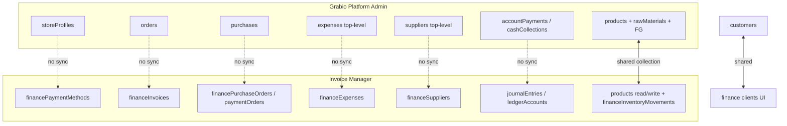

# Duplicate / Parallel Features Audit

**Grabio platform admin** (`src/pages/admin/*`) vs **Invoice Manager / finance module** (`suba eco sys/finance/beirut-finance-flow-main/src/*`)

**Date:** 2026-07-09  
**Scope:** Same business concept implemented twice with separate (or divergent) data models, UIs, or reporting — the payment-methods pattern (`/admin/payments` vs `/invoice/payment-methods`).

**Status:** Inventory only — no fixes applied. Use to decide architecture direction (unify long-term vs formal domain split).

---

## Executive summary

| Category | Count | Pattern |
|----------|-------|---------|
| **Hard split** (different Firestore paths, no sync) | 8 | payment methods, suppliers, expenses, POs, payments ledger, cash ops, staff/payroll, delivery ops |
| **Shared collection, divergent fields/behavior** | 3 | products, customers, store/company settings |
| **Parallel sales/invoicing** | 2 | platform orders vs finance invoices |
| **Parallel accounting** | 2 | Account Statement vs GL |
| **Parallel reporting** | 2 | Admin reports vs finance reports |
| **Surface-only** (same finance app, two URLs) | 1 | `/admin/finance/*` embed vs `/invoice/*` standalone |

**Highest silent-divergence risk:** suppliers, expenses, purchase workflows, operational payments vs GL, and dual invoicing (orders vs finance invoices).

---

## 1. Payment methods

| | **Grabio admin** | **Invoice Manager** |
|---|------------------|---------------------|
| **UI** | `/admin/payments` (`AdminPayments.tsx`) | `/invoice/payment-methods` (`PaymentMethods.tsx`) |
| **Purpose** | Storefront checkout gateways (Whish, Stripe, COD, etc.) | Invoice collection methods (cash, bank, credit terms) |
| **Storage** | `storeProfiles/{storeId}` — `paymentMethods`, `paymentGatewaySettings` | `stores/{storeId}/financePaymentMethods/{id}` |

**Should they relate?** Loosely — a COD gateway and a “cash” invoice method are related operationally but serve different flows (online checkout vs AR collection).

**Sync today?** No.

| Unify | Keep separate |
|-------|---------------|
| **Cost:** Medium — one config model + `scope: checkout \| invoice \| both` | **Cost:** Low — rename/label only |
| **Risk:** Breaking live checkout if invoice methods overwrite gateway secrets | **Risk:** Staff configure wrong screen; GL uses invoice methods only |

**Recommendation:** Formal domain split with cross-links and labels (“Checkout payments” vs “Invoice collection methods”). Unify only if you want one “money rails” catalog with scoped usage.

---

## 2. Products / inventory / costing

| | **Grabio admin** | **Invoice Manager** |
|---|------------------|---------------------|
| **UI** | `/admin/products`, `/admin/inventory`, `/admin/production`, `/admin/purchases` | `/invoice/products`, `/invoice/inventory` |
| **Catalog** | `products` (top-level) | **Same** `products` via `tableMap` |
| **Stock / costing** | `rawMaterials`, `finishedGoodsInventory`, `productionBatches`, purchase receiving → updates `products.stock`, `costPrice` | Invoice sale → `financeInventoryMovements` + direct `products.stock_quantity` / `stock` updates |
| **Cost overlay** | Recipe / FG engine (`finishedGoodsInventory`) | Read-time `rawPrice` overlay from FG (`platformUnitCost.ts`) |

**Should they relate?** Yes — one sellable catalog and one stock truth.

**Sync today?** **Partial / dangerous.** Same `products` collection, but:

- Field naming differs (`price` vs `sale_price`, `stock` vs `stock_quantity`) — mappers paper over this on finance writes.
- Finance products created with `financeCatalog: true`, `listedInStore: false`.
- Stock can move from **both** order fulfillment and invoice deduction without a single movement ledger on the admin side.

| Unify | Keep separate |
|-------|---------------|
| **Cost:** High — canonical product service, unified movement log, FG cost bridge | **Cost:** Medium — document “platform owns FG cost; finance reads overlay” |
| **Risk:** Stock double-count or drift; COGS wrong if FG and `rawPrice` diverge | **Risk:** Ongoing field-map bugs (staging `inventory_movements` id issue is symptomatic) |

**Recommendation:** Treat as **one catalog, split inventory engines** until a unified `inventory_movements` (or FG transactions) is the single write path for all stock changes.

---

## 3. Customers / clients

| | **Grabio admin** | **Invoice Manager** |
|---|------------------|---------------------|
| **UI** | Customers in orders, account statement | `/invoice/clients` (`ClientsManager`) |
| **Storage** | `customers` (top-level, `storeId`) | **Same** `customers` — finance `clients` → `tableMap` top-level |

**Should they relate?** Yes.

**Sync today?** **Mostly yes** (shared collection). Finance adds `financeClient: true` on create; admin may not set that flag. Filters can make the same person appear “admin-only” or “finance-only.”

| Unify | Keep separate |
|-------|---------------|
| **Cost:** Low — one Clients UI, drop `financeClient` flag or use tags | **Cost:** Very low — shared data already |
| **Risk:** Low if you stop duplicating UIs | **Risk:** Duplicate client records if users create separately without dedup |

**Recommendation:** **Not a data duplicate** — a **UI duplicate** on shared data. Merge navigation, keep one collection.

---

## 4. Suppliers

| | **Grabio admin** | **Invoice Manager** |
|---|------------------|---------------------|
| **UI** | `/admin/purchases`, supplier statements | `/invoice/suppliers` |
| **Storage** | `suppliers` (top-level) | `stores/{storeId}/financeSuppliers/{id}` |

**Should they relate?** Yes — same vendor for POs and supplier payments.

**Sync today?** **No.** Completely separate namespaces.

| Unify | Keep separate |
|-------|---------------|
| **Cost:** Medium — migration + dual-write period | **Cost:** Low short-term |
| **Risk:** AP, supplier statements, and finance POs reference different vendor IDs | **Risk:** **High** — silent duplicate vendors, wrong AP in GL reconciliation |

**Recommendation:** Top priority for unification or explicit **import/sync** from platform → finance.

---

## 5. Invoicing / revenue documents

| | **Grabio admin** | **Invoice Manager** |
|---|------------------|---------------------|
| **UI** | `/admin/orders` — generate invoice HTML/PDF, `invoiceNumber` from `storeProfiles` | `/invoice/invoices`, `/invoice/estimates` |
| **Storage** | `orders` + invoice fields on order; numbering on `storeProfiles` | `stores/{storeId}/financeInvoices`, `financeEstimates` |
| **GL** | No auto-posting | `autoPosting` / `glBridge` → `journalEntries` |

**Should they relate?** Depends on product strategy: e-commerce orders vs formal AR invoices.

**Sync today?** **No.** Two parallel revenue pipelines.

| Unify | Keep separate |
|-------|---------------|
| **Cost:** Very high — order→invoice bridge, numbering, GL for POS | **Cost:** Low if boundaries are clear |
| **Risk:** Double revenue if both record same sale; TB wrong | **Risk:** Finance suite (`AdminFinanceSuite`) ignores finance invoices entirely |

**Also note:** `AdminFinanceSuite` reads `orders` + top-level `expenses` only — not finance module data.

**Recommendation:** **Formal split:** platform orders = storefront sales; finance invoices = AR/accounting. Add optional “create finance invoice from order” bridge. Do **not** silently assume one includes the other.

---

## 6. Purchase orders (triple split)

| | **Grabio admin (active)** | **Grabio admin (legacy)** | **Invoice Manager** |
|---|---------------------------|---------------------------|---------------------|
| **UI** | `/admin/purchases` | `/admin/supplier-statements` | `/invoice/purchase-orders`, `/invoice/receipts` |
| **Storage** | `purchases` | `purchaseOrders` | `financePurchaseOrders`, `financePaymentOrders` |
| **GL** | None | None | PO receipt + mark-paid → GL |

**Should they relate?** Yes for procurement and AP.

**Sync today?** **No** across all three.

| Unify | Keep separate |
|-------|---------------|
| **Cost:** High — three schemas, receiving tied to `rawMaterials` on admin side | **Cost:** Medium — deprecate `purchaseOrders`, document “admin receives stock, finance records AP” |
| **Risk:** Paying twice, AP mismatch with GL | **Risk:** Users run POs in admin and finance separately |

**Recommendation:** Deprecate legacy `purchaseOrders` for new work. Choose **one PO system of record** (likely admin for inventory receiving + finance for AP/GL, with an integration event).

---

## 7. Expenses

| | **Grabio admin** | **Invoice Manager** |
|---|------------------|---------------------|
| **UI** | `/admin/expenses` | `/invoice/expenses` (and operational expense variants) |
| **Storage** | `expenses` (top-level) | `stores/{storeId}/financeExpenses`, `financeExpenseEntries`, `financeOperationalExpenses` |

**Should they relate?** Yes for P&L and GL.

**Sync today?** **No.**

| Unify | Keep separate |
|-------|---------------|
| **Cost:** Medium — migrate + GL backfill | **Cost:** Low |
| **Risk:** Admin reports and finance reports show different expense totals | **Risk:** **High** for accounting trust |

**Recommendation:** Finance expenses should feed GL (they do via auto-posting). Admin `expenses` are invisible to GL — **label admin as “operational petty cash”** or migrate to finance.

---

## 8. Payments / receipts (money movement)

| Concept | **Grabio admin** | **Invoice Manager** |
|---------|------------------|---------------------|
| Customer payments | `accountPayments` (Account Statement) | `financePayments`, `financeReceipts` |
| Supplier payments | Account statement / purchases paid flags | `financePaymentOrders` (Firestore-persisted) |
| COD / bank deposits | `cashCollections` | `financeCashCollections`, `financeCashTransactions` (schema; limited UI) |
| Order payments | `orders.paymentStatus`, `paymentMethod` | — |

**Should they relate?** Yes for cash position and reconciliation.

**Sync today?** **No** — four parallel payment ledgers.

| Unify | Keep separate |
|-------|---------------|
| **Cost:** Very high — single payments subledger + GL as source of truth | **Cost:** Low |
| **Risk:** Reconciliation nightmares, duplicate deposit recording | **Risk:** **Critical** — finance GL cash ≠ admin cash collections |

**Recommendation:** Long-term, **GL + one payments subledger**; admin account statement becomes a view. Short-term: document which screen is authoritative for each payment type.

---

## 9. Accounting / reconciliation

| | **Grabio admin** | **Invoice Manager** |
|---|------------------|---------------------|
| **UI** | `/admin/account-statement`, `/admin/bank-reconciliation` | `/invoice/accounting` |
| **Model** | Tabular debits/credits, `accountPayments`, multi-entity tabs | Double-entry GL: `ledgerAccounts`, `journalEntries`, `journalLines` |
| **Reconciliation** | Orders vs `cashCollections` | `buildReconciliationReport` — GL vs in-app cash/AR/AP snapshots |

**Should they relate?** Yes — one books.

**Sync today?** **No** — two accounting paradigms.

| Unify | Keep separate |
|-------|---------------|
| **Cost:** Very high — replace or wrap account statement with GL views | **Cost:** Low |
| **Risk:** Two “truths” for auditors | **Risk:** **Highest** architectural risk in the whole audit |

**Recommendation:** **GL is the future books.** Account Statement should be labeled “legacy operational ledger” or rebuilt as read-only GL + subledger views.

---

## 10. Staff / payroll

| | **Grabio admin** | **Invoice Manager** |
|---|------------------|---------------------|
| **UI** | `/admin/staff`, `/admin/salaries` | `/invoice/staff` (schema/routes exist) |
| **Storage** | `staff`, `salaryPayments` (top-level) | `financeStaff`, `financeStaffPayments` |

**Should they relate?** Yes.

**Sync today?** **No.**

| Unify | Keep separate |
|-------|---------------|
| **Cost:** Medium | **Cost:** Low |
| **Risk:** Salary expense in admin reports but not in GL | **Risk:** Duplicate HR records |

---

## 11. Reports / analytics

| | **Grabio admin** | **Invoice Manager** |
|---|------------------|---------------------|
| **UI** | `/admin/reports`, `/admin/analytics`, `/admin/revenue`, `AdminFinanceSuite` | `/invoice/reports` |
| **Data sources** | `orders`, `purchases`, `expenses`, `salaryPayments` | Finance collections + GL-derived views |

**Should they relate?** Yes for management reporting.

**Sync today?** **No** — different datasets by design today.

| Unify | Keep separate |
|-------|---------------|
| **Cost:** High — reporting layer on GL + operational facts | **Cost:** Low with clear labels (“Storefront” vs “Books”) |
| **Risk:** Decisions on wrong dataset | **Risk:** Confusion until unified |

---

## 12. Cash reconciliation (subset of §9)

| | **Grabio admin** | **Invoice Manager** |
|---|------------------|---------------------|
| **UI** | `AdminBankReconciliation` | Accounting → reconciliation tab |
| **Compares** | `orders` vs `cashCollections` | GL cash vs finance invoice/PO payment snapshots |

**Should they relate?** Yes.

**Sync today?** **No.**

**Risk:** Passing admin reconciliation does not imply GL cash is correct.

---

## 13. Delivery

| | **Grabio admin** | **Invoice Manager** |
|---|------------------|---------------------|
| **UI** | `/admin/delivery` | `/invoice/delivery` (if enabled in build) |
| **Purpose** | Storefront shipping **settings** (zones, fees, partners) | Operational **dispatch** (`financeDeliveryPersons`, `financeDeliveryOrders`) |
| **Storage** | `storeProfiles.deliverySettings` | `stores/{storeId}/financeDelivery*` |

**Should they relate?** Partially — config vs fulfillment.

**Sync today?** **No** (different layers).

**Risk:** Low vs suppliers/expenses — unless you assign finance delivery orders from platform orders without a link.

---

## 14. Currency / company settings

| | **Grabio admin** | **Invoice Manager** |
|---|------------------|---------------------|
| **UI** | Store profile, branding | `/invoice/settings`, `/invoice/currency` |
| **Storage** | `storeProfiles` (currency, invoice prefix/numbering) | `financeCurrencySettings`, `updateFinanceDocumentSettings` |

**Should they relate?** Yes — one default currency and invoice branding.

**Sync today?** **Partial** — invoice numbering on admin orders uses `storeProfiles`; finance invoices use their own doc settings.

**Risk:** Mixed currencies in UI (staging `formatCurrency` crash was a symptom of loose currency handling).

---

## 15. Inventory movements (granularity split)

| | **Grabio admin** | **Invoice Manager** |
|---|------------------|---------------------|
| **Movements** | `productionBatches`, FG transactions, purchase receiving | `financeInventoryMovements` |
| **Stock field** | Updates `products.stock` | Updates `products.stock` / `stock_quantity` |

**Should they relate?** Yes.

**Sync today?** **Parallel write paths** to the same stock field.

**Risk:** **High** — no single audit trail across production, purchases, and invoice sales.

---

## 16. Surface duplication (not data)

| Route | Notes |
|-------|--------|
| `/admin/finance/*` | Embedded finance SPA via `FinanceEmbeddedPage` |
| `/invoice/*` | Same finance build, standalone |

Same codebase, two entry points — not a data duplicate, but doubles nav confusion with native admin pages (`/admin/expenses` vs `/admin/finance/...`).

---

## What is *not* a duplicate

- **`/invoice/receipts`** — supplier payment orders + customer receipts; not a third payment-methods config.
- **Production / recipes** — platform-only; finance consumes output via FG costing, doesn’t duplicate recipe engine.
- **Admin AI agent, inventory production UI** — no finance parallel.

---

## Architecture decision matrix

### Suggested domain boundaries (if keeping split)

| Domain | System of record | Other system |
|--------|------------------|--------------|
| Checkout payment rails | Platform `storeProfiles` | Finance reads nothing |
| Invoice collection methods | Finance `financePaymentMethods` | Platform ignores |
| Sellable catalog | Platform `products` + FG | Finance reads cost overlay, writes stock only via defined hooks |
| Storefront sales | `orders` | Optional export to finance invoice |
| Books / GL | Finance GL | Platform account statement = legacy view |
| Procurement receiving | Admin `purchases` + inventory | Finance records AP/PO payment |
| Operational petty expenses | Migrate → finance | Admin UI deprecated |
| Vendors | **Pick one** — recommend platform `suppliers` + finance mirror | Until unified |

### Unification priority (risk × effort)

1. **Suppliers** — hard split, high AP risk, medium effort
2. **Expenses** — hard split, GL gap, medium effort
3. **Payments subledger** — many collections, very high effort
4. **PO workflow** — triple split, high effort
5. **Products/stock** — shared but divergent behavior, high effort
6. **Customers** — mostly UI merge, low effort
7. **Payment methods** — intentional split, labeling only
8. **Account statement vs GL** — strategic; GL wins long-term

---

## Next steps (when ready)

Pick one direction:

- **A. Unify long-term** — canonical entities + event bridge (order→invoice, purchase→finance PO, expense→GL).
- **B. Formal split** — written boundary doc + UI labels + “system of record” per concept + forbid silent dual entry.

---

## Related docs

- `docs/planning/finance-firestore-schema.md` — finance collection map
- `backlog.md` — GL phases and finance embed routes
