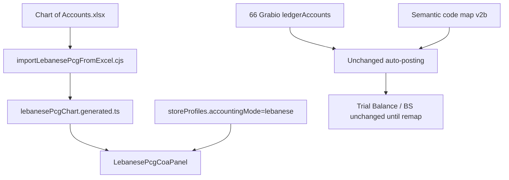

# Lebanese PCG v2 — Display & Chart Plan

**Status:** **Sprint complete** (prod 2026-07-29). Phases 1–3 shipped. E-Moove: 1/18 client codes mapped (`102`→`53001000002`); totals $264,993.40 unchanged. **Owner action:** bulk import remaining ERP codes via CSV.
**Store pilot:** E-Moove (`EZfuoNQFTJVU4cubNuckpp4K7zw2`)  
**Source template:** `the eco sys/Chart of Accounts.xlsx` (~394 PCG accounts)

## Problem (v1 gap)

v1 Lebanese mode only added Arabic labels on the **66-account Grabio SMB chart** (3-digit codes).  
Accountants expect the **PCG-style account list** from legacy ERP:

- Columns: **Code | Name | ArabicNa | M (G/D) | Cur**
- **Hierarchy** (headers + detail accounts, e.g. 601 → 6011 → freight/customs)
- Long numeric codes (client extensions up to 11 digits in live ERP)

**v1 was correct for GL integrity** (same JEs, same Balance Sheet). **v1 was wrong for UX.**

## Architecture (phased)

### Phase 1 — Display (this sprint)

- [x] Plan documented
- [x] Import Excel → `lebanesePcgChart.generated.ts` (code, name, nameAr, kind, parentCode)
- [x] `buildPcgTree()` + `LebanesePcgCoaPanel` (tree table, search, G/D badges, LL default)
- [x] Accounting → Chart of Accounts: **Lebanese mode shows PCG tree**; international keeps flat 66 list
- [x] Keep existing operational ledger table as secondary card (“Active posting accounts”)

**Out of scope Phase 1:** changing JEs, re-seeding E-Moove ledger, 11-digit client codes.

### Phase 2 — Semantic posting map

- [x] Map Grabio posting codes → PCG detail accounts (`grabioToPcgMap.ts`)
- [x] Trial Balance / Balance Sheet show PCG codes + names in Lebanese mode (posting unchanged)
- [x] COA panel highlights mapped PCG rows + Grabio link
- [ ] Optional: seed full PCG into `ledgerAccounts` as inactive + link `operationalCode`

### Phase 3 — Store extensions

- [x] Allow 11-digit **client sub-accounts** under PCG parents (like screenshots)
- [x] Currency per account (LL / USD)
- [x] Import/export COA CSV for accountants
- [x] Firestore `pcgClientAccounts` + rules; wired to Trial Balance / Balance Sheet / active COA

## E-Moove migration note

Backup: `backups/emoove-lebanese-pre-EZfuoNQFTJVU4cubNuckpp4K7zw2-*`  
Profile: `lebanese`, `bilingual`, `LBP`, locked.  
186 posted JEs — **do not reseed COA** until Phase 2 map is signed off.

## Verification

- PCG import: account count = Excel numeric rows; every HD has children in tree
- UI: Lebanese store sees Arabic column + G/D + hierarchy; international unchanged
- Regression: E-Moove Balance Sheet totals unchanged after Phase 1 UI-only deploy
