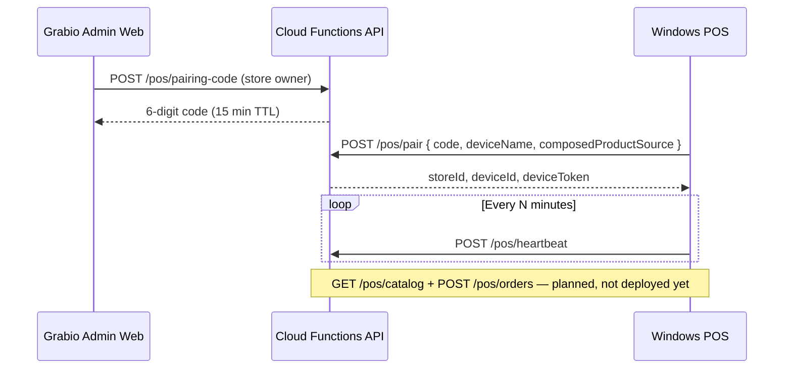

# Grabio POS — Windows Builder Handoff

> **Use the single handoff folder:** `the eco sys/ecosystem-plan/pos-windows-builder-pack/`  
> Zip: `the eco sys/ecosystem-plan/pos-windows-builder-pack.zip` · Start with `README.md`

**Date:** 2026-06-30  
**Owner:** Anwar  
**Platform:** Grabio ecosystem (`market-flow-7b074` / `grabio.space`)  
**POS codebase:** Windows Electron app (offline-first)

---

## 1. What you are building

Connect the **existing Windows POS** (Ayn Beirut POS v1) to **Grabio Firebase** — same `storeId`, products, and stock as the web admin. The POS stays a **native Windows app**; Grabio web is the control plane (pairing, catalog source, billing).

| Layer | Location | Role |
|-------|----------|------|
| **POS app (your work)** | `the eco sys/ecosystem-plan/posfinal-main/pos-v1/` | Electron + SQL.js, 100% offline sales |
| **Grabio web admin** | `src/pages/admin/PosPairing.tsx` → `/admin/pos` | Pairing UI, installer link, store ID |
| **Cloud API** | `functions/src/api/posSync.ts` | Pairing + heartbeat (catalog/orders TBD) |
| **Contract doc** | `docs/planning/pos-sync-contract.md` | API + Firestore schema |

**Do not** rebuild POS as a web app. **Do** add a Grabio sync layer beside the existing `sync-manager.js` (today points at legacy VPS).

---

## 2. Repo layout (Windows machine)

Clone the ecosystem repo, then open **only the POS folder** in Cursor/VS Code:

```
grabio space/
├── docs/planning/
│   ├── pos-sync-contract.md      ← API contract (read first)
│   └── pos-windows-handoff.md    ← this file
├── functions/src/api/posSync.ts  ← backend (Node — edit on Linux/Mac or WSL)
├── src/pages/admin/PosPairing.tsx
└── the eco sys/ecosystem-plan/posfinal-main/
    ├── AynBeirutPOS-Release/       ← shipped installer notes
    └── pos-v1/                     ← **PRIMARY WORK TREE**
        ├── electron-main.js
        ├── index.html
        ├── js/
        │   ├── pos-core.js
        │   ├── sync-manager.js     ← legacy VPS sync — add Grabio client alongside
        │   ├── db-sql.js
        │   └── ...
        ├── package.json
        └── README.md
```

**Run POS locally (Windows):**

```bat
cd "the eco sys\ecosystem-plan\posfinal-main\pos-v1"
npm install
npm start
```

Or use `START-POS-V1.bat` if present in release folder.

---

## 3. How Grabio connection works (target flow)



### Live today (production)

| Step | Where |
|------|--------|
| API base | `https://us-central1-market-flow-7b074.cloudfunctions.net/api` |
| Admin pairing page | `https://grabio.space/admin/pos` (requires `pos` module on store) |
| `POST /pos/pairing-code` | Owner session — returns `{ code, expiresInSeconds }` |
| `POST /pos/pair` | POS sends `{ code, deviceName, composedProductSource?: "platform" \| "pos" }` |
| `POST /pos/heartbeat` | POS sends `{ storeId, deviceId, deviceToken }` |

### Not implemented yet (your backlog)

| Endpoint | Purpose |
|----------|---------|
| `GET /pos/catalog` | Pull products + composed recipes when `composedProductSource=platform` |
| `POST /pos/orders` | Push completed sale → platform stock deduction |

See `docs/planning/pos-sync-contract.md` for Firestore paths and kitchen deduction rules.

---

## 4. Firestore data model (POS-relevant)

| Path | Purpose |
|------|---------|
| `storeProfiles/{storeId}` | `businessWorkflow`, `composedProductSource`, `posLocationCount`, `enabledModules.pos` |
| `stores/{storeId}/posPairingCodes/{code}` | Short-lived pairing codes |
| `stores/{storeId}/posDevices/{deviceId}` | Paired terminal + `apiKeyHash` |
| `products/{id}` | `storeId`, stock, composed recipe refs (platform catalog) |
| `orders/{id}` | Online orders; POS sales may mirror here later |

**Composed product source** (set at pairing, locked):

- `platform` — recipes live in Grabio; POS sells SKUs; platform deducts ingredients on sale (live kitchen).
- `pos` — POS owns recipe deduction locally; platform records outcome only.

---

## 5. POS app internals (read before coding)

| Module | File | Notes |
|--------|------|-------|
| Database | `js/db-sql.js`, `js/db.js` | SQL.js SQLite, local file |
| Sales | `js/pos-core.js` | Cart, checkout, receipts |
| Composed products | `js/inventory.js`, recipe tables | Local BOM |
| Legacy sync | `js/sync-manager.js` | VPS endpoint — **do not delete** until Grabio path proven |
| Auth | `js/auth.js` | Local users — add Grabio device token storage |

**Suggested new files:**

```
pos-v1/js/grabio/
  grabio-config.js      — storeId, deviceId, deviceToken, apiBase
  grabio-pairing.js     — UI flow for 6-digit code
  grabio-sync.js        — heartbeat, catalog pull, order push
```

Persist tokens in `app_settings` or encrypted local storage (same pattern as `sync-manager.js` VPS config).

---

## 6. Module gate & billing

- Store must have `enabledModules.pos === true` (or legacy tier that includes POS).
- `posLocationCount` on `storeProfiles` — first location included in Kitchen preset; +$15/mo per extra (enforced in subscription flow).
- Test store: ask Anwar for a store with POS module enabled.

---

## 7. Deploy rules (builder)

| Change | Who / how |
|--------|-----------|
| POS Windows app only | Build installer locally; upload to Firebase Storage `pos/` or hand binary to Anwar |
| `posSync.ts` API changes | `cd functions && npm run build` then `firebase deploy --only functions:api` — **Anwar approval** |
| Grabio web `/admin/pos` | `npm run build` + `firebase deploy --only hosting` — **Anwar approval** |
| **Never** push Firestore rule changes without review |

---

## 8. QA checklist (Windows)

- [ ] Install POS on clean Windows 10/11 VM
- [ ] Enable POS module on test store (Grabio admin → Subscription)
- [ ] Generate pairing code at `/admin/pos`
- [ ] Pair from POS → receive `deviceToken`
- [ ] Heartbeat updates `lastSyncAt` on device doc
- [ ] Sale offline → queue → push when online (when `/pos/orders` exists)
- [ ] Live kitchen: composed sale deducts stock per `composedProductSource`

---

## 9. Related docs

| File | Content |
|------|---------|
| `docs/planning/pos-sync-contract.md` | API + deduction contract |
| `the eco sys/ecosystem-plan/plan-ecosys.md` | Ecosystem vision, POS module |
| `the eco sys/ecosystem-plan/posfinal-main/pos-v1/README.md` | POS feature list |
| `the eco sys/ecosystem-plan/posfinal-main/pos-v1/IMPLEMENTATION-STATUS.md` | Legacy status |
| `docs/planning/cursor-new-machine-setup.md` | Cursor rules/skills on new PC |
| `backlog.md` | Workstream POS section |

---

## 10. Contact / credentials

- Support: support@grabio.space  
- Firebase project: `market-flow-7b074`  
- Credentials: **never in git** — Anwar provides `.credentials.md` separately on secure channel  
